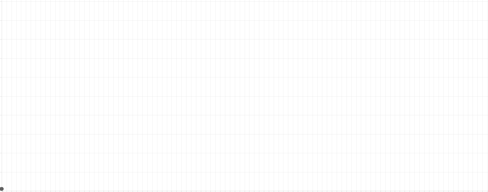

# Drawable.Chart.js

Plugin for Chart.js that allows users to draw charts

Installation
------------

Drawable.Chart.js is available for download in multiple ways. 
The package relies on [Chart.js](https://github.com/nnnick/Chart.js), 
which will be installed in addition to this package
if Drawable.Chart.js is installed with `bower` or `npm`.

- Bower: `bower install Drawable.Chart.js`
- NPM: `npm install drawable.chart.js`
- Zip: [Download](https://github.com/zachpanz88/Drawable.Chart.js/archive/master.zip) | [Download Chart.js](https://github.com/nnnick/Chart.js/archive/v1.0.2.zip)
- Tarball: [Download](https://github.com/zachpanz88/Drawable.Chart.js/archive/master.tar.gz) | [Download Chart.js](https://github.com/nnnick/Chart.js/archive/v1.0.2.tar.gz)

Documentation is coming soon.
